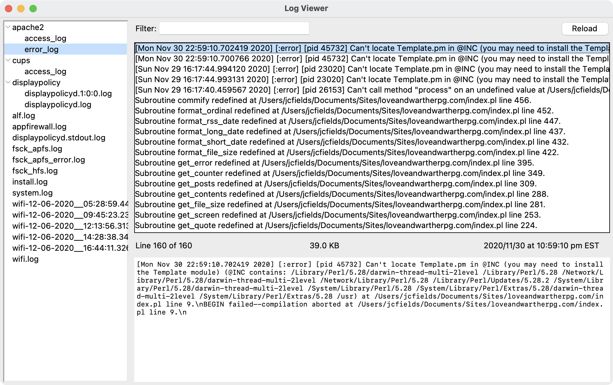

# log-viewer

A utility for viewing log files. Written in Tcl using the Tk GUI toolkit.

## Acknowledgments

Uses [log](https://www.svgrepo.com/svg/130988/log) and [magnifying glass](https://www.svgrepo.com/svg/57025/magnifying-glass) graphics from [SVG Repo](https://www.svgrepo.com/).

## Authors

- J.C. Fields <jcfields@jcfields.dev>

## License

- [MIT license](https://opensource.org/licenses/mit-license.php)
